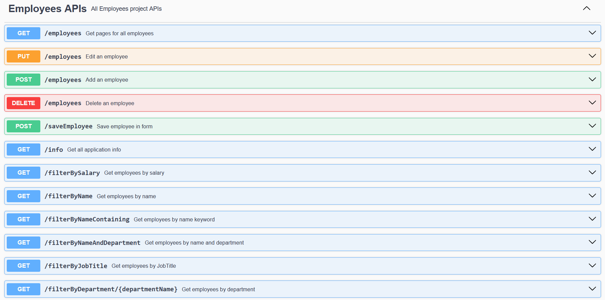

# Employees APIs
Employees management project using Spring Boot

## Table of Contents

- [Project Overview](#project-overview)
- [Getting Started](#getting-started)
    - [Prerequisites](#prerequisites)
    - [Running the Application](#running-the-application)
- [Project Description](#project-description)
- [Project APIs](#project-APIs)

## Project Overview

In this project, we intend to create a basic employee management system using spring boot, MySQL and Thymeleaf templates.
## Getting Started

### Prerequisites
The project using Spring boot 3 and Java 17

### Running the application
To run the application (using terminal) with development profile:

    mvn clean install 
    cd .\target\
    java -jar .\employees-1.0.1.jar --spring.profiles.active=dev

## Project Technologies

1. Spring Boot (Spring web, Spring Validation, Spring JPA)
2. MySQL 
3. Thymeleaf
4. OpenAPI for documentation
5. Lombok
6. Docker and Docker-compose

## Project APIs

